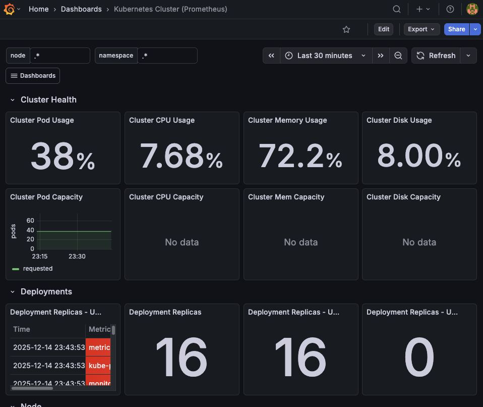

# Kubernetes Cluster Monitoring with Prometheus Operator and Grafana

This project demonstrates monitoring and alerting in a DevOps environment using Kubernetes, Prometheus Operator, and Grafana.

## Tools Used

- Prometheus
- Grafana
- Alertmanager
- Docker (for Minikube)
- Helm
- kubectl

## Setup
### 1. Create a Kubernetes Cluster
```bash
minikube start --cpus=4 --memory=6g --addons=metrics-server
```

### 2. Add Helm Repositories 
```bash
helm repo add prometheus-community https://prometheus-community.github.io/helm-charts
helm repo add grafana https://grafana.github.io/helm-charts
helm repo update
```


### 3. Create a Namescape
```bash
kubectl create namespace monitoring
```

### 4. Install Prometheus + Grafana 
```bash
helm install monitoring prometheus-community/kube-prometheus-stack \
  --namespace monitoring \
  --set grafana.enabled=true \
  --set prometheus.prometheusSpec.serviceMonitorSelectorNilUsesHelmValues=false
```

### 5. Verify Pods
```bash
kubectl get pods -n monitoring
```

### Access Grafana
Port-forward Grafana
```bash
kubectl port-forward -n monitoring svc/monitoring-grafana 3000:80
```

### Grafana 

Open the URL: http://localhost:3000

- Username: admin
- Password: pass 

### Access Prometheus 
Port-forward Prometheus
```bash
kubectl port-forward -n monitoring svc/monitoring-grafana 3000:80
```

Open the URL: http://localhost:9090

### Alerts 

#### Custom Alert Rule

Review custom-alerts.yaml to see the PrometheusRule that detects high CPU usage.

Apply the Rule

```bash
kubectl apply -f custom-alerts.yaml
```

#### Screenshoot 




